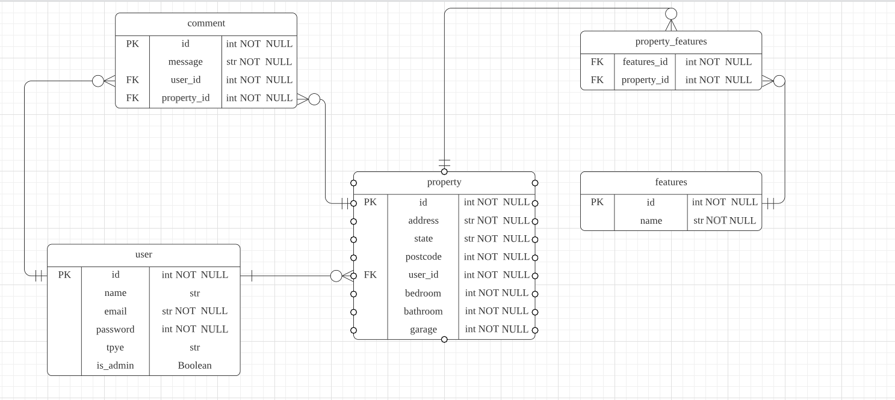

# R1 Identification of the problem you are trying to solve by building this particular app
  
My app is a real estate management system designed to bring together scattered listings of properties that are interested in selling or buying/renting and unify them for users to browse and select the homes they want.

## R2 Why is it a problem that needs solving?
 
With the diversification of life or some force majeure factors (such as living in another state buyer/seller and during the covid period of lock dowm), resulting in many people do not want to go to the site to see the property like the original, only through the Internet way to learn about the desired property online, plus the original way of distributing paper flyers is too wasteful of resources, so through the online way has become increasingly popular in recent years, my program is to solve this problem of people do not want to go out and want to learn about the relevant properties.

## R3 Why have you chosen this database system. What are the drawbacks compared to others?
 
The database I chose was PostgreSQL, the reason is that

1. PostgreSQL was a database I had just learned and I could use it directly without spending time and effort to learn a completely new database.  
2. It is an open source database and it is free.  
3. It is the only relational database that is compatible with SQL, which means it has no contradictions in its consistency and legacy features.  
4. It has higher readability and cleaner and tidier code compared to NO-SQL.  
5. It provides procedural language to implement complex procedures via Python.

I think the drawbacks are

1. Postgresql's multi-version concurrency control is not very good,i.e. the database has many versions of data instead of many versions of the database itself, so when you need to process a piece of data, you need to determine which version of data to use before you can process the operation.  This will generate a lot of data and take up a lot of space,which needs to be cleaned up regularly.
2. Postgresql takes a long time to expand its capacity.

## R4 Identify and discuss the key functionalities and benefits of an ORM
 
ORM is short for Object-Relational-Mapper is a library that allows you to manipulate data in a database using an object-oriented approach.

An ORM library is a library written in the language of your choice that has encapsulated the SQL code needed to manipulate the data, and you can interact directly with the database objects using the language of your choice.  

ORM provides a mapping relationship between classes and database tables.  

Data table mapping classes: Use classes to create instances, and the system automatically operates on the tables when the instances are modified or deleted.  

Data table's row mapping object: The class generates many instances, and each instance corresponds to a row of records in the data table.

Data table's column mapping object properties: When the program modifies the properties of an object ORM will automatically convert it into an operation corresponding to the rows and columns in the data table.

The benefits are  

1. Dry code, easy to update and maintain.
2. Avoid bugs caused by writing SQL.  
3. Simple call method.  
4. Use your own programming language.
5. The application no longer accesses the underlying database directly, but converts the object-oriented operations into the underlying SQL operations, that is, the operations of adding, modifying, querying and deleting objects into the corresponding operations on the database.

## R5 Document all endpoints for your API

@auth_bp.route('/users/', methods=['GET'])   Get all user information  
@auth_bp.route('/register/', methods=['POST'])  User registration interface  
@auth_bp.route('/login/', methods=['POST'])  User Login Interface  
@comments_bp.route('/', methods=['GET'])  Get all user comments  
@comments_bp.route('/<int:property_id>/', methods=['GET'])  Get all comments based on a property  
@feature_bp.route('/', methods=['GET'])  Get all features  
@feature_bp.route('/<int:feature_id>', methods=['GET'])  Get all features of a property  
@feature_bp.route('/<int:id>', methods = ['PUT','PATCH']) Update comments  
@properties_bp.route('/', methods=['GET']) Get all properties  
@properties_bp.route('/<int:property_id>/', methods=['GET']) Get information about one property  
@properties_bp.route('/', methods=['POST']) Create a new property  
@properties_bp.route('/<int:property_id>/', methods=['DELETE']) Delete a property
@properties_bp.route('/<int:property_id>/', methods = ['PUT','PATCH']) Update a property
@properties_bp.route('/<int:property_id>/features/', methods=['POST']) Update a property's features
@properties_bp.route('/<int:property_id>/features/', methods=['GET']) Get a property's features
@properties_bp.route('/<int:property_id>/comments/', methods=['POST']) Create a property's comments
@properties_bp.route('/<int:property_id>/comments/', methods=['GET']) Get a comment of a property
@properties_bp.route('/<int:property_id>/comments/', methods=['DELETE']) Delete a property's comments

## R6 An ERD for your app

In my API application there has 5 tables, user, comment, property, feature and property_feature. 

user table stores user information such as name, email, password, user type, and whether they are admin. there are messages in the comment table. In the property table, there is information about address, postcode, state, bedroom, bathroom, and garage. In the feature table, there are names of features. 

user and comment table are one-to-many, a user can create multiple comments, a comment can only correspond to a user. 

The user and property tables are one-to-many, a user can have multiple properties and a property can only have one user.

The relationship between comments and properties table is one-to-many, a property can have multiple comments, a comment can only exist in a property. 

properties and features table are many-to-many, a property property_features is used as a jion table to connect many-to-many relationships.

## R7 Detail any third party services that your app will use

bcrypt:This is a file encryption program that uses a hashing algorithm to convert plaintext passwords into unintelligible text to ensure the security of the password.

click:This is the package that creates the cli command.

Flask:This is a micro WEB framework written in python, you can quickly implement small and medium-sized websites, it can add a lot of extension packages to enhance the corresponding functionality.

Flask-JWT-Extended:This is a package that adds a JSON token to provide security during user authentication.

marshmallow:This is a package for data type conversion, used to convert SQL statements and python language.

SQLAlchemy:It converts python classes into tables in a relational database and automatically converts functions into SQL statements.

psycopg2:This is a driver for PostgreSQL database, which is used to perform various operations on PostgreSQL using python.

pip-review:This is a software that automatically checks if there are packages that need to be updated and can automatically update all packages.

## R8 Describe your projects models in terms of the relationships they have with each other

According to my ERD, there are five data tables, User, Comment, Property, Features and property_features, where property_features is used as an associated table to connect property and features.

SQLAlchenmy as an ORM turns User, Comment, Property, and Feature class objects in python into corresponding data tables in a database through relational mapping, and its unit of work consists of a transparent system of synchronizing all state changes between objects and their associated rows.

The SQLAlchemy defines a module-level structure from which we will query database data. This structure, also known as a declarative mapping, defines both the python object model and the database metadata that represents the SQL tables that exist or actually exist in the database.

Take User class as an example. Modle as the default module to write the parameter list, __tablename__ as the name of the mapped database table, Column is used to add the attributes of the entities in the table, Integer and String are the server default information and constraint information, nullable is to indicate that the attribute cannot be null. 

primary_key is the column that every table must have as part of the primary key.relationship represents the connection between two ORM classes.

In my program Marshmallow is a package to convert SQL statements into python language, i.e. serialization and deserialization. Use the dump() method convert a python object into JSON and additionally allows you to store the information into a file and the dumps() method returns a python object into a serialized JSON object. Use the load() method to Deserializes a JSON file object into a standard python object, and loads() method Deserializes a json object to a standard python object.

In the UserSchema Class because the type parameter needs to validate the data so required=Ture.fields is the column to be displayed, ordered=True is the order in which it is written.

## R9 Discuss the database relations to be implemented in your application

According to ERD, in the User table there are id, name, Email, password, type and whether the column is admin, only the id as the primary key of the user table no foreign key.

In the comment table, there are id, message, and date columns, with id as the primary key and user_id and property_id as foreign keys.

In the property table there are id, address, state, postcode, bedrooms, bathrooms, and garages columns id as primary key and user_id as foreign key.

Columns with id and name in the FEATURES table, where id is used as the primary key.

The relationship between the User table and the comment table is one-to-many, i.e., a User can publish multiple comments, but each comment can only be published by one User.  

The relationship (Comment) in the User table and the relationship (User) in the comment table indicate that these two tables are related to each other.Because the relationship is bidirectional, the back_populates keyword should be added.

comments = db.relationship('Comment', back_populates='user') 
parents = comments, Parent is Comment, child is user.
user = db.relationship('User', back_populates='comments')  
child is user, Child is User and parents is comments.

The relationship between the User table and the Property table is a one-to-many relationship, i.e., a User can have multiple Properties but each Property can belong to only one User. Because the relationship is bidirectional, the back_populates keyword should be added. 

properties = db.relationship('Property', back_populates='user')  
parents is properties, Parent is Property and child is user.
user = db.relationship("User", back_populates="properties") 
child is user, Child is User and parents is properties.

The relationship between the Comment table and the Property table is many-to-one, i.e., a property can have many comments but a comment can only exist on one property, and when the property is deleted the comments that exist on that property will also be deleted automatically.Because the relationship is bidirectional, the back_populates keyword should be added.

comments = db.relationship("Comment", back_populates="property", cascade="all, delete")  
parents is comments, Parent is Comment and child is property.
property = db.relationship('Property', back_populates='comments')
child is property, Child is pPrperty and parents is comments.

The relationship between the Property table and the Feature table is many-to-many, i.e., a property can have many features and the same feature can be owned by many properties. Because it is a many-to-many relationship, here we need to add an association_table association table, because there are only left and right table foreign keys in the table, so we need to use the secondary and back_populates keywords.Because the relationship is bidirectional, the back_populates keyword should be added.

properties = db.relationship("Property", secondary=association_table, back_populates="features")  
children is properties,Child is Property, parents is Features.
features = db.relationship("Feature", secondary=association_table, back_populates="properties")
parents is features, Parent is Feature, children are properties.

## R10 Describe the way tasks are allocated and tracked in your project

https://trello.com/b/aS3cx4PE/api-project  
There are 4 lists in my Trello: "TO DO", "IN PROGRESS", "CODE REVIEW", and "DONE". At the beginning of the project I divided the whole project into small goal cards and set the estimated completion time. Every morning I check the goal cards for the day and move the completed cards to another list in the evening. Finally, when all the goal cards were completed, my project was finished!
